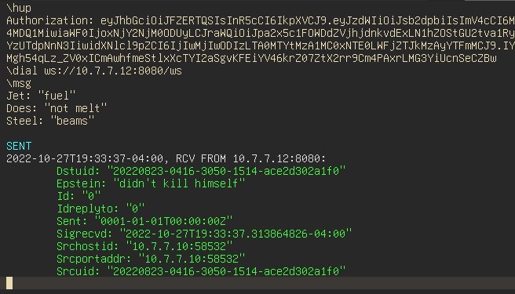

# vim-wscli

A websocket test client for Vim



## Installation

Requires *wscli*:
```sh
go install -v github.com/BourgeoisBear/wscli
```

Then clone this plugin into your Vim plugins directory:
```sh
cd ~/.vim/pack/plugins/start
git clone https://github.com/BourgeoisBear/vim-wscli
```
Rebuild helptags with `helptags ALL`, then see `:help wscli` for more options.

## Commands
```
Connect to Websocket
	\dial ws://127.0.0.1:8080/ws

Disconnect from Websocket
	\hup

Send Message (heredoc format)
	\msg [message terminator]
	message line 1
	message line 2
	message line 3
	[message terminator]

	(default terminator is a blank line if left unspecified)

Specify HTTP Headers
	Authorization: awo875pu84uj6paj436up
	Content-Type: application/json

List Specified HTTP Headers
	\hdrlst

Clear Specific HTTP Header (key without value)
	Authorization:

Clear All Specified HTTP Headers
	\hdrclr
```
